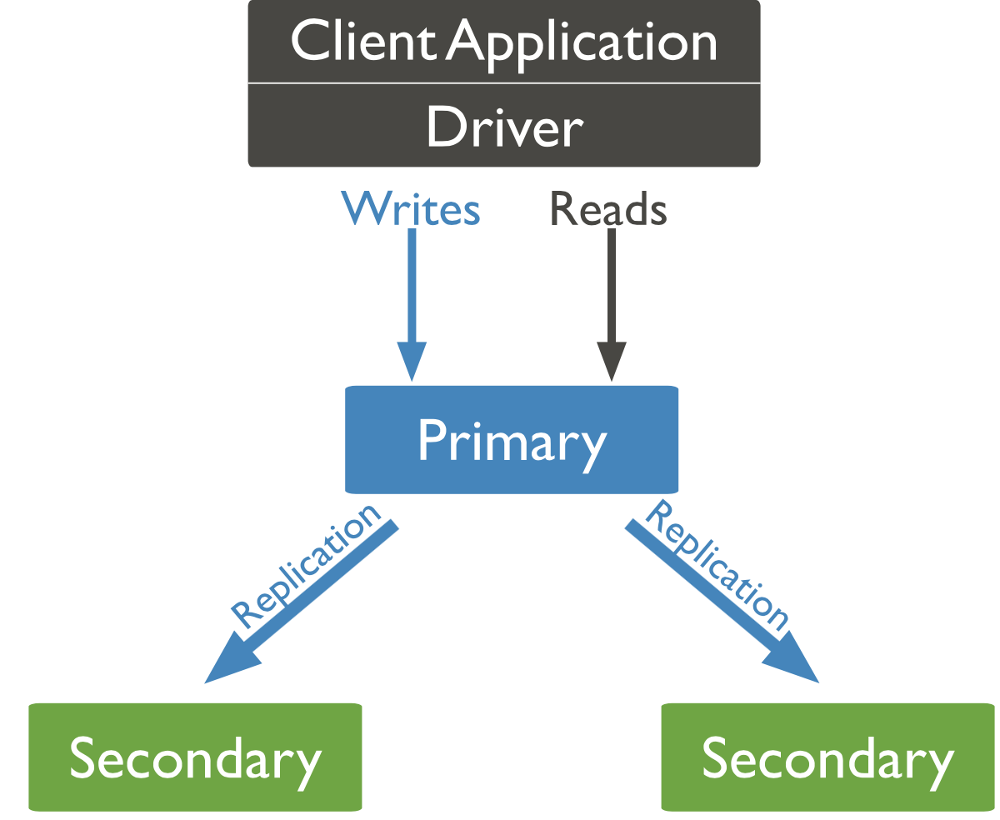
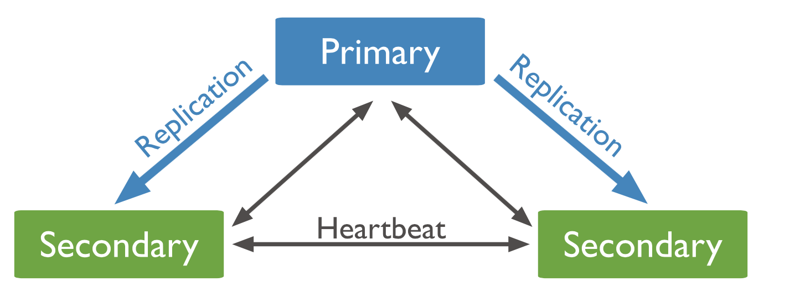
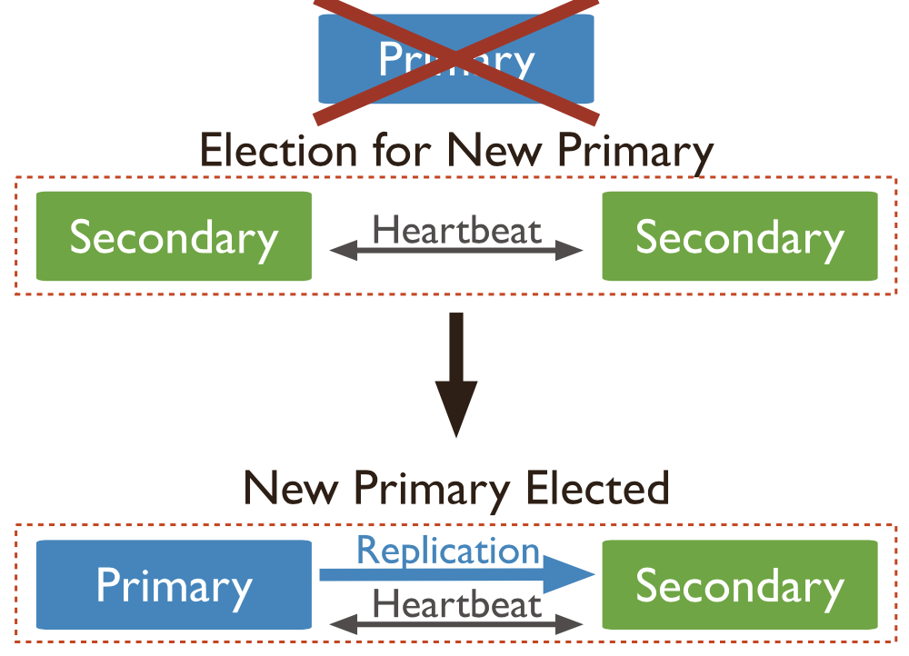

# MongoDB 副本集

**MongoDB 中的副本集是一组维护同一数据集的 mongod 进程。副本集提供冗余和高可用性, 是所有生产部署的基础**

* ###MongoDB 中的复制

    副本集是一组维护相同数据集的 mongod 实例。副本集包含多个数据轴承节点和可选的一个仲裁节点。在数据轴承节点中, 只有一个成员被视为主节点, 而其他节点则被视为副本节点
    
    
      
    主节点接收所有的写入操作，副本集只能有一个主功能。主要记录对它的数据集的所有变动在它的操作日志，即oplog，副本负责复制主 oplog, 
    并将这些操作应用到其它数据集，以便副本的数据集反映主数据集，副本集实例相互保持心跳，当检验到某个mongod 实例心跳停止时，自动摘除该mongod 
    实例，如主节点被摘除，则进入仲裁，选举，自动切换主节点
    
    

    可以将额外的 mongod 实例添加到副本集作为仲裁者，仲裁人不维护数据集,仲裁者的目的是通过响应其他副本集成员的心跳和选举请求来维护副本集中的仲裁。因为它们不存储数据集,所以仲裁员可以提供比具有数据集的完全功能的副本集成员更便宜的资源成本,从而为复制集仲裁功能带来一个很好的方法。如果您的副本集有偶数的成员, 则添加仲裁人以在初选的选举中获得多数选票。
    
* ###故障自动切换

    当主不与设置的其他成员通信超过配置的electionTimeoutMillis期间 (默认为10秒) 时, 合格的次要要求选举提名自己为新主。该群集试图完成新的初选和恢复正常操作的选举  
    
    
    
    如果默认的 replica configuration settings, 
    则在群集选择新主项之前的中间时间通常不应超过12秒。这包括将主标记为不可用并调用并完成选举所需的时间。通过修改 settings.electionTimeoutMillis 复制配置选项来调整这个时间段。诸如网络延迟等因素可能会延长复制副本集选举所需的时间, 这反过来会影响群集在没有主计算机的情况下运行的时间量。这些因素取决于特定群集体系结构
    
    将 electionTimeoutMillis 复制配置选项从默认的10000 (10 秒) 中降低会导致对主故障的快速检测。但是, 群集可能会更频繁地调用选举, 原因是临时网络延迟, 即使主要是健康的。这会导致 w: 1 写操作增加回滚 。
    
* ###副本集成员分类

    * #####主成员
        
        主是副本集中唯一接收写操作的成员，主接收所有写操作，然后次复制oplog
        应用与它们的数据集，副本集的所有成员都可以接收读取操作，但是默认情况下，应用程序将读取操作定向到主，主再分发读取请求到其它成员
    
    * #####副本成员
        
        * 优先级为 0 的副本成员
            
            它们可以正常辅助，维护数据集的副本，接受读取请求，并在选举中投票，但是 priority 0 (即该成员) 不能成为初选成员，不参与选举，即它们永远不会成为主
            
        * 隐藏成员
        
            隐藏成员必须是优先级为 0 的副本成员，同时，它们维护数据集但不接受读取请求，隐藏成员不会接收除了以外其它来的任何通信
            
        * 延迟成员
        
            延迟成员必须是隐藏成员，它们的数据集反应了副本集中的数据集的早期或延迟状态，例如某延迟成员被设定延迟 
            半小时，则该成员的数据集是主数据集半小时以前的数据集。所以它是数九的滚动备份，或运行的历史快照。   
                
    * #####仲裁成员
    
        仲裁成员仅在选举时投票，不参与数据集的维护
        
        
* ###副本集体系结构部署

    * #####部署策略
    
        * 确定成员数量
        
            根据mongodb设定的策略，确定成员分配
            
        * 投票成员的最大数目
        
            副本集最多可以有50个50 members, 但只有7个投票成员。如果副本集已有7个投票成员, 则其他成员必须为非投票成员
            
        * 部署奇数个投票成员
        
            确保副本集的投票成员数目为奇数，否则将需要部署一个仲裁者
        
        * 为专用使用隐藏或延迟成员
        
            添加隐藏或延迟成员以支持专用功能，如备份或报告。    
        
        * 标记副本集成员
        
            为副本集成员打 tag, 副本集允许使用副本集标记将对特定成员的读取操作设置为目标             
            
        * 使用日志记录防止电源断电
        
            MongoDB 默认启用日志记录，日志记录可防止出现服务中断时的数据丢失
            
            
                         